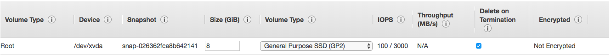

# aws ec2에 graylog 설치

## ec2 생성

> Step 1: Choose an Amazon Machine Image (AMI)

- Amazon Linux 2 AMI (HVM), SSD Volume Type - ami-afd86dc1

  Amazon Linux 2 comes with five years support. It provides Linux kernel 4.14 tuned for optimal performance on Amazon EC2, systemd 219, GCC 7.3, Glibc 2.26, Binutils 2.29.1, and the latest software packages through extras.

- Amazon Linux AMI 2018.03.0 (HVM), SSD Volume Type - ami-ebc47185 **# selected**

  The Amazon Linux AMI is an EBS-backed, AWS-supported image. The default image includes AWS command line tools, Python, Ruby, Perl, and Java. The repositories include Docker, PHP, MySQL, PostgreSQL, and other packages.

> Step 2: Choose an Instance Type

- t2.micro **# selected**

> Step 3: Configure Instance Details

- Number of instances: 1
- Purchasing option: [ ]
- Network: **vpc-5xxxx | Beta**
- Subnet: subnet-xxxx | Beta-WAS-C | ap-northeast-2c
- Auto-assign Public IP: **Enable**
- Placement group: [ ]Add instance to placement group.
- IAM role: None
- Shutdown behavior: Stop
- Enable termination protection: [ ]Protect against accidental termination
- Monitoring: [ ]Enable CloudWatch detailed monitoring
- Tenacy: Shared - Run a shared hardware instance
- T2 Unlimited: [ ]Enable

> Step 4: Add Storage

  

> Step 5: Add Tags

- Key/Value: Name/log-server.beta **주의) key명 대소문자 구별함.**

> Step 6: Configure Security Group

- Assign a security group: (O)Select an existing security group

> Step 7: Review Instance Launch

- Launch> Select an existing key pair or create a new key pair
- Launch Instances

##
